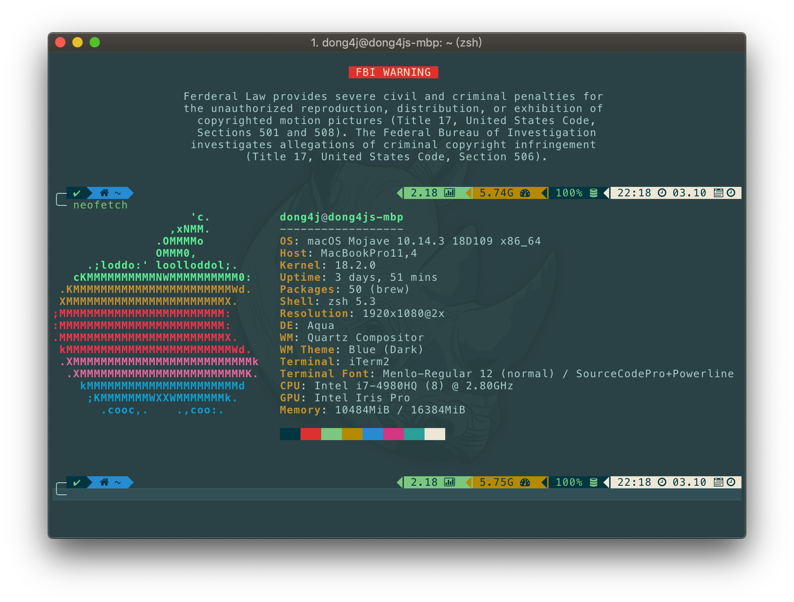

 
 
  

<h3 align="center">
    <a href="./start/">准备工作</a>
     · 
    <a href="./2-tool-chain/">工具链</a>
     · 
    <a href="./github/contribute.html">参与贡献</a>
</h3>

---

## [Changelog 更新日志](./github/changelog.md)

**Star and watch**, 时刻掌握最新面试题 💪

## Contributing 贡献

### Contributors 贡献者

任何有经验的同学欢迎来这里添加补充内容. Fork > PR > Review > Merge 一条龙. 💗

**占坑**

### How to contribute 贡献规范

目前来讲, 此项目仍然有很多地方需要完善, 此项目的文档收集于网络, 再者由于个人能力有限, 有些知识点未理解到位或者理解错误, 希望有经验的大佬前来帮我共同完善本项目, 鞠躬. 

在你着手准备给这个项目提交一些新内容前, 请务必阅读「贡献」相关内容说明与规范 > [CONTRIBUTE](./github/contribute.md)

## License 许可  

本作品采用 [知识共享署名-非商业性使用-相同方式共享 4.0 国际许可协议](http://creativecommons.org/licenses/by-nc-sa/4.0/)进行许可.

本著作係採用 [創用 CC 姓名標示-非商業性-相同方式分享 4.0 國際 授權條款](http://creativecommons.org/licenses/by-nc-sa/4.0/)授權.

This work is licensed under a [Creative Commons Attribution-NonCommercial-ShareAlike 4.0 International License](http://creativecommons.org/licenses/by-nc-sa/4.0/).

---

